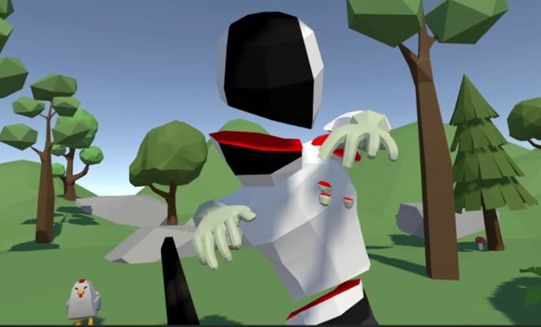

# Cut Off

《砍爆》是一个使用unity编写的简易vr游戏。

挥舞你手中的长剑来砍爆向你走来的敌人吧！

在oculus quest2上可以正常运行。

## 介绍

《砍爆》是学校课程《虚拟现实开发技术》的大作业项目。

它最终取得了95分的最高分(老师说的🥰)。

《砍爆》使用了以下资源：

- [Oculus Integration](https://assetstore.unity.com/packages/tools/integration/oculus-integration-82022)(用于与VR设备交互)

- Mesh Slicer(用于制作切割效果)

- SimpleNaturePack

- CharacterPack Lowpoly (FREE)

- IVT_LowPoly_Weapon

- Meshtint Free Chicken Mega Toon Series

该仓库仅上传核心部分，大部分资源由于大小问题并未上传இ௰இ。

## 预览

[完整视频演示](imgs/video.mp4)

